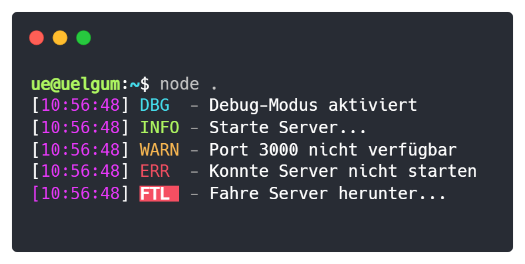

<div align="center">
    <h1><code>@uelgum/logger</code></h1>
    <br/>
    <p>
        <a href="https://github.com/uelgum/logger"></a>
        <a href="./LICENSE"></a>
    </p>
</div>

<p align="center">
    
</p>

## Über
`@uelgum/logger` ist ein simpler und hübscher Logger für NodeJS-Projekte.

- Einfache API
- Angenehme Ausgabe in die Konsole
- Unterstützung für rotierende Log-Dateien
- Unterstützung für TypeScript

## Benutzung
```ts
import { Logger } from "@uelgum/logger";

const logger = new Logger({
    level: "INFO"
});

logger.info("Hallo Welt!");
```

## API
#### Konstruktor
Erstellt einen neuen Logger.

```ts
new Logger(options: Options);
```

**Parameter**
| Name      | Typ            | Beschreibung             | Optional |
|-----------|----------------|--------------------------|----------|
| `options` | [`Options`][2] | Optionen für den Logger. | ❌       |

#### `.debug(message: unknown)`
Erstellt einen Debug-Log (`DBG`).

```ts
logger.debug(message: unknown);
```

**Parameter**
| Name      | Typ       | Beschreibung              | Optional |
|-----------|-----------|---------------------------|----------|
| `message` | `unknown` | Auszudruckende Nachricht. | ❌       |

#### `.info(message: unknown)`
Erstellt einen Info-Log (`INFO`).

```ts
logger.info(message: unknown);
```

**Parameter**
| Name      | Typ       | Beschreibung              | Optional |
|-----------|-----------|---------------------------|----------|
| `message` | `unknown` | Auszudruckende Nachricht. | ❌       |

#### `.warn(message: unknown)`
Erstellt einen Warn-Log (`WARN`).

```ts
logger.warn(message: unknown);
```

**Parameter**
| Name      | Typ       | Beschreibung              | Optional |
|-----------|-----------|---------------------------|----------|
| `message` | `unknown` | Auszudruckende Nachricht. | ❌       |

#### `.error(message: unknown)`
Erstellt einen Error-Log (`ERR`).

```ts
logger.error(message: unknown);
```

**Parameter**
| Name      | Typ       | Beschreibung              | Optional |
|-----------|-----------|---------------------------|----------|
| `message` | `unknown` | Auszudruckende Nachricht. | ❌       |

#### `.fatal(message: unknown)`
Erstellt einen Fatal-Log (`FTL`).

```ts
logger.fatal(message: unknown);
```

**Parameter**
| Name      | Typ       | Beschreibung              | Optional |
|-----------|-----------|---------------------------|----------|
| `message` | `unknown` | Auszudruckende Nachricht. | ❌       |

#### `Level`
Level des Loggers.

| Stufe | Bezeichnung | Name    |
|-------|-------------|---------|
| 1     | `DBG`       | Debug   |
| 2     | `INFO`      | Info    |
| 3     | `WARN`      | Warnung |
| 4     | `ERR`       | Error   |
| 5     | `FTL`       | Fatal   |

#### `Options`
Optionen für den Logger.

```ts
type Options = {
    level: Level;
    dateFormat?: string;
    logPath?: string;
    writeFile?: boolean;
};
```

| Name         | Typ          | Beschreibung                                             | Defaultwert  | Optional |
|--------------|--------------|----------------------------------------------------------|--------------|----------|
| `level`      | [`Level`][1] | Level des Loggers.                                       | -            | ❌        |
| `dateFormat` | `string`     | Format des Zeitstempels.                                 | `"HH:mm:ss"` | ✔️        |
| `logPath`    | `string`     | Pfad zu den Log-Dateien.                                 | `null`       | ✔️        |
| `writeFile`  | `boolean`    | Ob Logs zusätzlich in Dateien geschrieben werden sollen. | `false`      | ✔️        |

<!-- Links -->
[1]: #level
[2]: #options